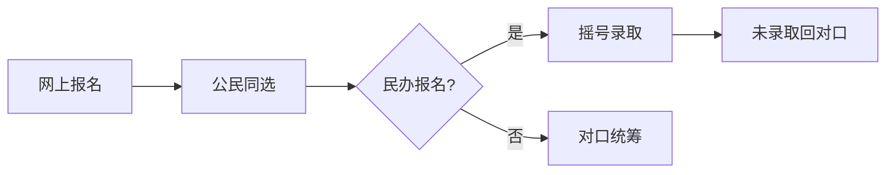

## 定义
> 公民同招是指公办学校和民办学校同步招生，民办学校实行电脑随机录取（摇号）

## 政策背景
- 2018年起上海实施
- 目的是遏制民办学校"掐尖"招生
- 维护教育公平

## 招生流程

## 关键规则
1. **同步报名**: 公办和民办只能选一个
2. **民办摇号**: 报名超计划则电脑随机录取
3. **未录民办**: 回对口公办统筹安排
4. **托底保障**: 公办保底

## 风险提示
- ⚠️ 选民办未录取可能统筹到更差的学校
- ⚠️ 热门民办中签率低（通常30-50%）
- ⚠️ 建议公办"保底"后再冲民办

## 相关概念
- [[五年一户]]
- [[统筹]]
- [[民办学校]]